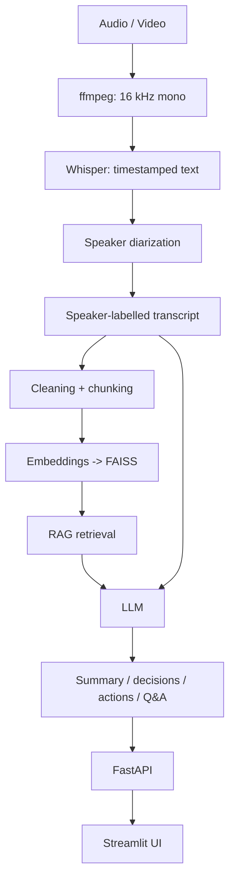

# MeetingMind

Meeting intelligence pipeline in Python: speech-to-text, speaker diarization,
summarization, decision/action-item extraction, and retrieval-based Q&A over
meeting transcripts.

**Status:** in development. Speech-to-text is implemented and tested;
diarization and everything after it are not built yet.

## Goal

Given a meeting recording, produce a speaker-labelled, timestamped transcript,
a summary, decisions and action items, and answers to questions that cite the
speaker and time they came from.

## Target architecture (planned, not yet implemented beyond step 2)



## Progress

- [x] Project design and component analysis
- [x] AMI annotation exploration (notebook 01)
- [x] Label construction, session-level split (notebook 02)
- [x] Baseline experiments for a decision/action classifier (notebook 03)
- [x] Audio extraction + faster-whisper transcription service, 21 unit tests (notebook 04)
- [ ] Meeting-domain WER on AMI
- [ ] Speaker diarization + alignment
- [ ] Summarization, decision/action extraction
- [ ] Embeddings, FAISS, RAG Q&A
- [ ] FastAPI backend, Streamlit UI

## Experiment 1: decision/action classifier on AMI

I tested whether a model should be trained for decision/action detection.
Labels were derived from AMI's links between extractive summary utterances
and abstractive summary sentences. Baselines used logistic regression with
session-grouped 5-fold cross-validation on train+val (test split untouched).

| Model | macro-F1 (action/decision/problem) | F1 (decision or action) |
|---|---|---|
| Length only | 0.054 ± 0.009 | 0.056 ± 0.011 |
| TF-IDF, utterance | 0.158 ± 0.016 | 0.144 ± 0.015 |
| TF-IDF, utterance + context | 0.214 ± 0.028 | 0.191 ± 0.028 |


**Conclusions.** Neighbouring context helps. Error analysis showed that many
false positives are genuine unlabelled actions, some positives are utterances
that only support a decision discussion, and top features are scenario-specific
("rubber", "teletext"). The labels therefore measure summary selection, not
decision statements, so I did not fine-tune a transformer on them. Decision and
action extraction will use an LLM, evaluated against AMI's human-written
decision/action summary sentences.

## Speech-to-text (faster-whisper)

Audio or video is converted with ffmpeg to 16 kHz mono and decoded into an
array that is passed to Whisper. Output keeps segment and word timestamps,
word probabilities and confidence signals (`avg_logprob`, `no_speech_prob`,
`compression_ratio`).

LibriSpeech test-clean subset (100 random utterances, seed 42, Colab T4, float16).
This is clean read speech and is **not** representative of meeting audio.

| Model | WER % | Real-time factor | GPU memory (MB) |
|---|---|---|---|
| small | TBD | TBD | TBD |
| large-v3 | TBD | TBD | TBD |

WER uses a simple normalizer (lowercase, punctuation removed). It does not map
digits to words, so values are not directly comparable to published figures.

## Repository structure

```
app/
  core/config.py                      # environment-driven settings
  models/transcription.py             # Word / Segment / Transcript
  services/transcription_service.py   # faster-whisper wrapper
  utils/audio_utils.py, text_utils.py
notebooks/                            # 01-04 experiments
tests/                                # pytest unit tests
reports/                              # result tables (CSV)
docs/images/                          # figures used in this README
```

## Setup

```bash
python -m venv .venv
.venv\Scripts\activate        # Windows
pip install -r requirements.txt
pytest
```
ffmpeg must be installed and on PATH. Notebook 04 is designed for a Google Colab T4 GPU.

## Data and licenses

- AMI Meeting Corpus (CC BY 4.0): https://groups.inf.ed.ac.uk/ami/download/
  Carletta et al., "The AMI Meeting Corpus: A Pre-announcement", 2005.
- LibriSpeech (CC BY 4.0): https://www.openslr.org/12
  Panayotov et al., "LibriSpeech: an ASR corpus based on public domain audio books", 2015.
- Whisper: Radford et al., "Robust Speech Recognition via Large-Scale Weak Supervision", 2022.

Datasets are downloaded by the notebooks and are not included in this repository.
Code is released under the MIT License.

## Limitations (current)

- No diarization yet; transcripts have no speaker labels.
- ASR accuracy on real meetings (overlap, far-field) has not been measured yet.
- The AMI decision/action labels are incomplete and scenario-specific; see Experiment 1.
- English only so far.
